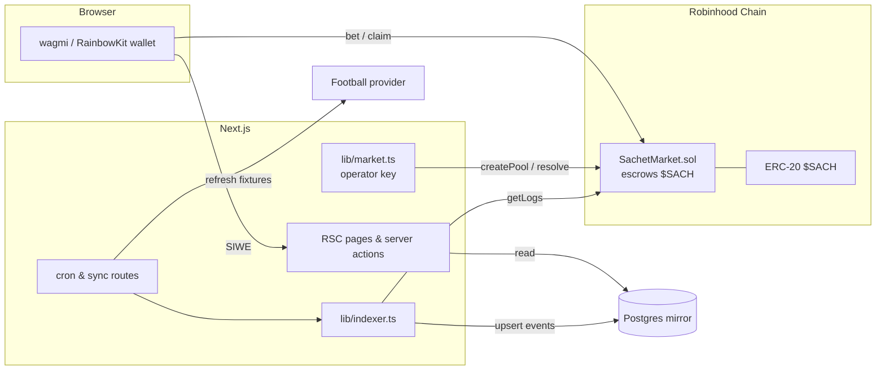

# Sachet Market

A pari-mutuel prediction market for 1X2 football results, settled on-chain in
`$SACH`. Players stake on **HOME / DRAW / AWAY**; the whole pool is distributed
proportionally to the winning side, minus a rake. It is the on-chain successor
to the earlier points/stars version — money now lives in a single escrow
contract, and Postgres is a rebuildable read mirror.

> **Chain is the source of truth.** The `SachetMarket` contract escrows every
> stake and pays every winner. Postgres exists only to make reads fast and to
> hold football metadata; it can be dropped and rebuilt from events at any time.

---

## Table of contents

- [How it works](#how-it-works)
- [Architecture](#architecture)
- [Tech stack](#tech-stack)
- [Quick start](#quick-start)
- [Environment variables](#environment-variables)
- [Database](#database)
- [Smart contract](#smart-contract)
- [Running the app](#running-the-app)
- [Cron & data-sync endpoints](#cron--data-sync-endpoints)
- [Admin dashboard](#admin-dashboard)
- [Project structure](#project-structure)
- [Testing & quality gates](#testing--quality-gates)
- [Deployment](#deployment)
- [Security notes](#security-notes)

---

## How it works

1. **Fixtures are ingested.** `/api/sync/fixtures` pulls fixtures from the
   configured football provider and upserts rows into `Match`. No pools are
   created by sync.
2. **An admin opens a pool.** From `/admin`, an allowlisted wallet calls
   `createPool` (signed server-side by the operator key) for a match. The
   on-chain pool id is deterministic:
   `keccak256(utf8("sachet:1x2:" + match.externalId))`, so there is exactly one
   pool per match.
3. **Players bet.** The wallet sends `$SACH` to `bet(poolId, selection, amount)`
   from the browser. The contract escrows the tokens and tracks stake per
   selection. Betting is rejected at/after `expiresAt`.
4. **The pool resolves.** After expiry, the operator calls
   `resolve(poolId, outcome)` — either automatically via `/api/cron/settle`
   (from the final score, or `VOID` if the match was cancelled), or manually
   from `/admin`.
5. **The indexer mirrors.** `/api/cron/index` reads `SachetMarket` logs and
   applies them to Postgres, so the board, bet history, and leaderboard reflect
   on-chain state.
6. **Winners pull.** Each winner/refundee calls `claim(poolId)` from
   `/my-bets`; tokens move from the contract to the wallet.

### Payout math

Identical in the contract (`contracts/src/SachetMarket.sol`) and the read-side
mirror (`lib/odds.ts`), both integer-floor:

```
rake          = floor(totalStake * rakeBps / 10000)
distributable = totalStake - rake
payout        = floor(distributable * userStakeOnWinner / winningStake)
```

- **VOID** (cancelled match) or **no one backed the winning outcome** → full
  refund to everyone, **no rake taken**.
- Rake accrues to `treasuryBalance` and is swept with `withdrawTreasury`.
- Integer division leaves tiny dust in the contract; this is expected.

Outcome codes: `HOME=1`, `DRAW=2`, `AWAY=3`, `VOID=4`, `OUTCOME_UNRESOLVED=0`.

---

## Architecture



- **Identity** is the lowercase wallet address from Sign-In With Ethereum
  (`config/nextauthConfg.ts`, `lib/session.ts`). No email, no passwords.
- **Money paths**: the browser signs `bet`/`claim`; the server operator key
  signs `createPool`/`resolve`/`withdrawTreasury` (`lib/market.ts`).
- **Reads** come from the Postgres mirror (`lib/pools.ts`, `lib/bets.ts`,
  `lib/leaderboard.ts`), which the indexer rebuilds from contract events.

---

## Tech stack

| Layer      | Choice                                                          |
| ---------- | --------------------------------------------------------------- |
| Frontend   | Next.js 16 (App Router, RSC), React 19, Tailwind 4, shadcn/ui    |
| Wallet     | wagmi 3, viem 2, RainbowKit, SIWE via NextAuth v5 beta           |
| Chain      | Robinhood Chain (EVM), Solidity 0.8.24 + OpenZeppelin, Foundry   |
| Database   | PostgreSQL via Prisma 7 (`prisma-client` generator)              |
| Tests      | Foundry (`forge`) for Solidity, Vitest for pure TS               |
| Data       | API-Football or Football-Data.org behind `FootballService`       |
| Package mgr| Yarn 4 (Berry)                                                   |

---

## Quick start

Prerequisites: **Node 20+**, **Yarn 4**, a **Postgres** database, and
**[Foundry](https://book.getfoundry.sh/getting-started/installation)** for the
contract tests.

```bash
# 1. Install JS deps (runs `prisma generate` on postinstall)
yarn install

# 2. Configure env
cp .env.example .env       # fill in DATABASE_URL, AUTH_SECRET, CRON_SECRET, chain vars
#    Prisma CLI reads .env (not .env.local); Next.js reads both.

# 3. Apply the schema
yarn db:migrate            # dev: create + apply the migration
# or, in CI/prod:
#   npx prisma migrate deploy

# 4. (Optional) build & test the contract
cd contracts
forge install foundry-rs/forge-std OpenZeppelin/openzeppelin-contracts
cd ..
yarn forge:test            # 25 tests

# 5. Run the app
yarn dev                   # http://localhost:3000
```

To go end-to-end on a local chain, also deploy the contract (see
[Smart contract](#smart-contract)) and set `MARKET_ADDRESS` +
`MARKET_DEPLOY_BLOCK`, then seed fixtures and open a pool from `/admin`.

---

## Environment variables

Copy `.env.example`. Server-only names and their browser-visible
`NEXT_PUBLIC_*` mirrors are both required whenever the client needs a value
(`config/chains.ts` reads `NEXT_PUBLIC_*` first, then the bare name).

| Variable | Purpose |
| --- | --- |
| `DATABASE_URL` | Postgres connection string. Prisma CLI reads `.env` only. |
| `AUTH_SECRET` / `AUTH_URL` | NextAuth signing secret and canonical origin (must match the SIWE domain). |
| `FOOTBALL_PROVIDER` | `football-data` (default) or `api-sports`. |
| `FOOTBALL_DATA_API_KEY` / `API_FOOTBALL_API_KEY` | Provider keys (only the active one is required). |
| `CRON_SECRET` | Bearer/query secret guarding `/api/cron/*` and `/api/sync/*`. |
| `CHAIN_ID`, `CHAIN_NAME`, `RPC_URL`, `EXPLORER_URL` | Robinhood Chain endpoint and metadata. |
| `SACH_TOKEN_ADDRESS`, `SACH_TOKEN_DECIMALS` | The ERC-20 the market escrows. |
| `MARKET_ADDRESS`, `MARKET_DEPLOY_BLOCK` | Deployed `SachetMarket` and indexer start block. |
| `TREASURY_ADDRESS` | Recipient of swept rake (contract constructor arg). |
| `OPERATOR_PRIVATE_KEY` | Server hot key that signs `createPool`/`resolve`/`withdrawTreasury`. |
| `DEPLOYER_PRIVATE_KEY` | One-shot key used by `yarn deploy:market`. |
| `ADMIN_ADDRESSES` | CSV allowlist of wallets permitted to open/resolve pools. |
| `MIN_STAKE` | Contract minimum stake in base units (e.g. `1000000000000000000` = 1 $SACH). |
| `INDEXER_CONFIRMATIONS` | Reorg safety margin for the indexer (default `5`). |
| `NEXT_PUBLIC_*` | Browser mirrors of chain id/name/rpc/explorer/token/market + `NEXT_PUBLIC_WALLET_CONNECT_PROJECT_ID`. |

`config/chains.ts` falls back to local anvil defaults (`31337`,
`http://127.0.0.1:8545`) so `next build` works before deploy-time values exist.

---

## Database

Postgres is a **mirror**, not the ledger. Schema: `prisma/schema.prisma`.

| Model | Role |
| --- | --- |
| `User` | Wallet identity (lowercase address, unique). |
| `Match` | Football fixture + score, mirrored from the provider. |
| `Pool` | One per match; holds `onchainPoolId`, `rakeBps`, `closesAt`, stake split, winning selection. |
| `Bet` | Mirrored `BetPlaced`; status flow `PENDING → WON/LOST/VOID → CLAIMED`. |
| `ChainEvent` | Raw decoded log (unique on `txHash,logIndex`) — audit and safe replay. |
| `ChainCursor` | Indexer high-water mark (`<chainId>:<market>`). |

`PoolStatus.LOCKED` is derived from `closesAt` at read time — no cron flips it.
`BetStatus.WON` / `VOID` mean claimable on-chain.

Commands:

```bash
yarn db:migrate     # prisma migrate dev
yarn db:generate    # regenerate client into generated/prisma (gitignored)
yarn db:push        # push schema without a migration (prototyping)
yarn db:pull        # introspect an existing DB
```

The initial migration lives at
`prisma/migrations/20260920000000_init/migration.sql`. It was generated offline
with `prisma migrate diff`; apply it with `npx prisma migrate deploy`.

---

## Smart contract

Source: `contracts/src/SachetMarket.sol` (Solidity 0.8.24, OpenZeppelin
`SafeERC20` + `ReentrancyGuard`). Full interface and design notes live in
[`SMART_CONTRACT.md`](./SMART_CONTRACT.md).

```bash
# Tests (from repo root)
yarn forge:test                       # forge test --root contracts

# Build the artifact, then export its ABI into lib/contracts/sachet-market.ts
cd contracts && forge build && cd ..
yarn export:abi                       # node scripts/export-abi.mjs

# Deploy (requires RPC_URL, SACH_TOKEN_ADDRESS, TREASURY_ADDRESS,
# OPERATOR_PRIVATE_KEY, DEPLOYER_PRIVATE_KEY, MIN_STAKE)
yarn deploy:market                    # prints MARKET_ADDRESS + MARKET_DEPLOY_BLOCK
```

`contracts/lib/*` (forge-std, OpenZeppelin) is gitignored; install it with
`forge install` per `contracts/README.md`. After deploying, paste the printed
`MARKET_ADDRESS` / `MARKET_DEPLOY_BLOCK` into your env.

---

## Running the app

```bash
yarn dev        # development
yarn build      # production build
yarn start      # serve the production build
yarn lint       # eslint
```

Routes:

| Route | Purpose |
| --- | --- |
| `/` | Board — open pools with live odds and countdowns. |
| `/pools/[id]` | Pool detail + bet sheet. |
| `/my-bets` | Wallet's bets and on-chain `claim` buttons. |
| `/leaderboard` | Accuracy ranking (min 10 settled bets, top 25). |
| `/admin` | Allowlisted pool open/resolve. |

All app routes sit under `app/(app)/`, whose layout is a SIWE gate
(`AuthGate`) and forces dynamic rendering.

---

## Cron & data-sync endpoints

All are guarded by `lib/cron-auth.ts`, accepting either
`Authorization: Bearer $CRON_SECRET` or `?secret=$CRON_SECRET`.

| Endpoint | Method | Purpose |
| --- | --- | --- |
| `/api/cron/index` | GET/POST | Mirror new `SachetMarket` logs into Postgres. Safe every 1–2 min. |
| `/api/cron/settle` | GET/POST | Refresh just-kicked-off matches, `resolve`/`VOID` their pools. Safe ~every 10 min. |
| `/api/sync/fixtures` | POST | Upsert fixtures. Body: `{ date?, league, season, provider? }`. |

```bash
curl -H "Authorization: Bearer $CRON_SECRET" http://localhost:3000/api/cron/index
curl -H "Authorization: Bearer $CRON_SECRET" http://localhost:3000/api/cron/settle
curl -X POST -H "Authorization: Bearer $CRON_SECRET" -H "Content-Type: application/json" \
  -d '{"league":"PL","season":2026}' http://localhost:3000/api/sync/fixtures
```

The indexer is idempotent and stores the cursor plus every raw log, so a partial
run replays safely. `resolve` is only called for matches past expiry, so a
settle run normally still has `stillPending > 0`.

---

## Admin dashboard

`/admin` is gated twice: the app layout requires a SIWE session, and the server
actions (`app/(app)/admin/actions.ts`) re-check `isAdmin` against
`ADMIN_ADDRESSES`. Admin wallets never sign directly — every on-chain write is
executed by the server operator key.

- **Open pool** — pick a scheduled match with no pool, set expiry and rake
  (capped at 1000 bps). A DB row is written first as `PENDING_ONCHAIN`, then
  confirmed to `OPEN` once `createPool` mines; a failure leaves the row
  retryable.
- **Resolve pool** — choose `HOME`/`DRAW`/`AWAY`/`VOID`. Already-resolved pools
  are rejected.

---

## Project structure

```
app/
  (app)/                 SIWE-gated: board, pools/[id], my-bets, leaderboard, admin
  api/auth/[...nextauth] NextAuth SIWE handlers
  api/cron/{index,settle} Chain mirror + settlement cron
  api/sync/fixtures      Fixture ingestion
components/
  pools/                 Pool card, bet sheet, countdown, team logos
  wallet/                Auth gate, balance, bet row, claim button
  admin/                 Admin panel
  shared/                Nav, app provider
  ui/                    shadcn/ui primitives
config/
  chains.ts              Env-driven chain/token/market config
  wagmiConfig.ts         Wagmi + RainbowKit client config
  nextauthConfg.ts       NextAuth v5 SIWE provider
contracts/
  src/SachetMarket.sol   Escrow + pari-mutuel engine
  test/                  Foundry tests (+ MockERC20)
lib/
  chain/server-client.ts viem public + operator wallet clients
  contracts/             Generated ABIs (sachet-market.ts, erc20.ts)
  market.ts              Operator-signed createPool/resolve/withdraw
  indexer.ts             Chain → Postgres mirror
  football-sync.ts       Fixture sync + settlement
  pools.ts / bets.ts / leaderboard.ts   Server read layers
  odds.ts                Parity-tested payout math
  onchain.ts             Codes + pool-id derivation
  session.ts / admin.ts  Auth identity + admin allowlist
  prisma.ts              Prisma client singleton
prisma/                  Schema + migrations
scripts/                 deploy-market.ts, export-abi.mjs
services/                FootballService + provider implementations
```

---

## Testing & quality gates

```bash
yarn forge:test   # 25 Solidity tests (unit + 2 fuzz), incl. payout parity
yarn test         # Vitest: lib/odds.test.ts (contract parity), lib/leaderboard.test.ts
npx tsc --noEmit  # type check
yarn lint         # eslint
yarn build        # production build
```

`vitest.config.ts` scopes tests to `lib/**/*.test.ts` (contracts and generated
code excluded). `tsconfig.json` excludes `contracts`. `lib/odds.test.ts` proves
the off-chain math matches the contract for the same inputs — keep the two in
sync if you touch payout logic.

---

## Deployment

1. Set every env var (server + matching `NEXT_PUBLIC_*` mirrors) for the target
   chain.
2. Apply the migration: `npx prisma migrate deploy`.
3. Deploy the contract: `forge build` → `yarn export:abi` → `yarn deploy:market`;
   record `MARKET_ADDRESS` and `MARKET_DEPLOY_BLOCK`.
4. Build and start: `yarn build && yarn start`, or deploy to Vercel.
5. Point a scheduler at `/api/cron/index` (frequently) and `/api/cron/settle`
   (every ~10 min) with the `CRON_SECRET` bearer. Seed fixtures via
   `/api/sync/fixtures` or open pools from `/admin`.
6. Fund/authorize the operator key for gas; confirm the admin allowlist.

---

## Security notes

- `OPERATOR_PRIVATE_KEY` is a server-only hot key; it never reaches the browser
  and is used solely for `createPool`/`resolve`/`withdrawTreasury`.
- Admin actions are allowlist-gated **and** re-checked server-side; the admin's
  own wallet never signs on-chain.
- The contract uses `SafeERC20`, `nonReentrant`, checks-effects-interactions,
  and pull payments (`claim`), with no unbounded loops.
- `CRON_SECRET` guards all quota-consuming and write routes.
- `$SACH` is the only asset escrowed; the contract does not touch native gas.
- `.env*` and the generated Prisma client are gitignored — never commit secrets.
